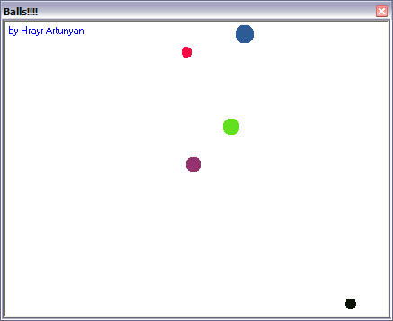



## Balls\!\!\!\! Try it out\.

### Description

This is a small fun program with absolutely no practical use. It is written for the sole purpose of demonstration. It is balls in a container(picture box), as you move or resize the form the balls inside it move. Have fun and please let me know what you think!
 
### More Info
 

             |
---                |---
**Submitted On**   |2004-06-12 03:01:34
**By**             |[Hrayr Artunyan](https://github.com/Planet-Source-Code/PSCIndex/blob/master/ByAuthor/hrayr-artunyan.md)
**Level**          |Beginner
**User Rating**    |4.7 (28 globes from 6 users)
**Compatibility**  |VB 4\.0 \(32\-bit\), VB 5\.0, VB 6\.0
**Category**       |[Graphics](https://github.com/Planet-Source-Code/PSCIndex/blob/master/ByCategory/graphics__1-46.md)
**World**          |[Visual Basic](https://github.com/Planet-Source-Code/PSCIndex/blob/master/ByWorld/visual-basic.md)
**Archive File**   |[Balls\!\!\!\!\_1756476122004\.zip](https://github.com/Planet-Source-Code/hrayr-artunyan-balls-try-it-out__1-54336/archive/master.zip)

